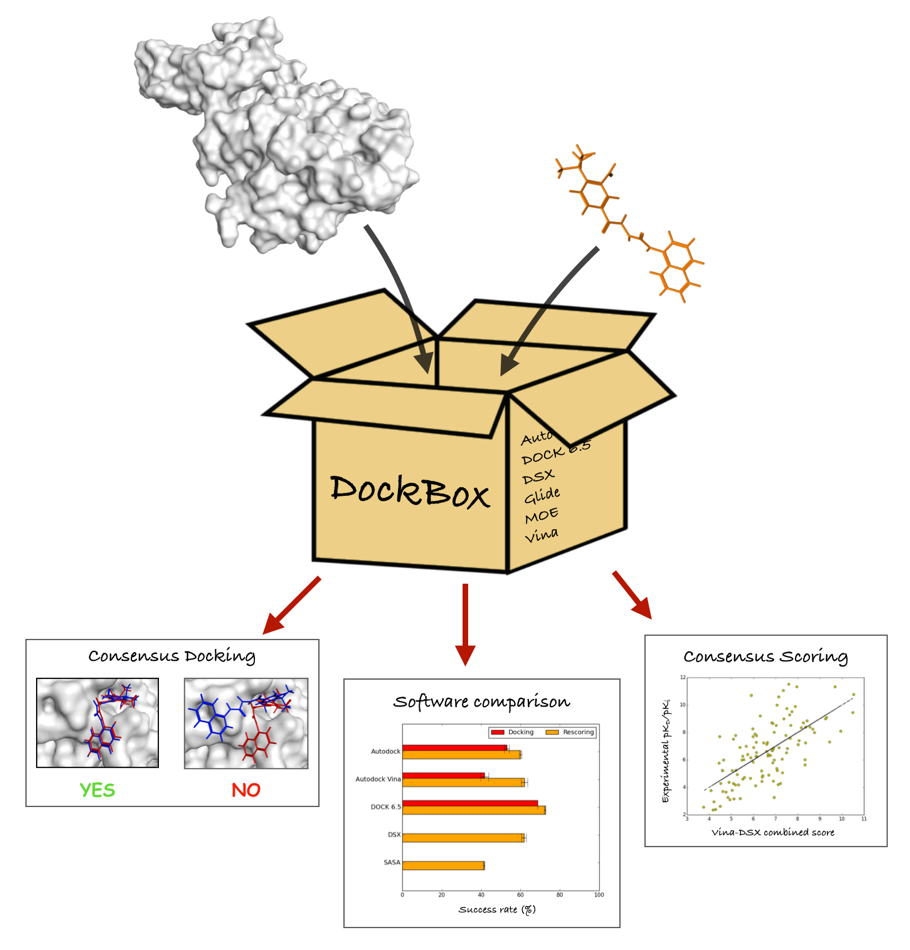

*******
DockBox
*******

DockBox is a python wrapper library designed to facilitate the use of standard docking
programs either alone or in combination. In addition, DockBox enables to rescore the
generated docking poses with different popular scoring algorithms as well as to analyze
the results using different consensus docking/scoring strategies.

**List of programs supported by DockBox**

* **Docking**:

  * AutoDock 4 (http://autodock.scripps.edu)
  * AutoDock Vina (http://vina.scripps.edu/index.html)
  * DOCK 6.5 (http://dock.compbio.ucsf.edu/DOCK_6/index.htm)
  * Glide (https://www.schrodinger.com/glide)
  * GOLD (https://www.ccdc.cam.ac.uk/solutions/csd-discovery/components/gold/)
  * MOE (https://www.chemcomp.com/MOE-Molecular_Operating_Environment.htm)

* **Rescoring**:

  * AutoDock 4 (http://autodock.scripps.edu)
  * AutoDock Vina (http://vina.scripps.edu/index.html)
  * DSX (http://pc1664.pharmazie.uni-marburg.de/drugscore/)
  * Glide (https://www.schrodinger.com/glide)
  * MOE (https://www.chemcomp.com/MOE-Molecular_Operating_Environment.htm)

None of the above docking or scoring programs are included in the current repository.
Hence the user eager to test a docking/scoring program with DockBox should first 
install the program separately on the same system DockBox is installed. 

To make a docking or scoring program usable by DockBox, make sure all the executable files
required for each program can be directly run on the command line from any location,
i.e., are in your PATH (see section **executable files required for each program** 
to find out the executables needed to run each docking/scoring programs). For MOE and 
Glide, additional environment variables should be set up, MOE and SCHRODINGER, respectively.

.. contents:: **Table of Contents**

Prerequisites
*************

The following are the minimal requirements to install the DockBox module

* python version 2.6 or 2.7

* virtualenv version 1.11 or later

* pip version 1.5 or later

To be completed...

Installation
************

To be completed...

Executable files required for each program
******************************************

Any software intended to be used in conjunction with DockBox should be installed separetely and should work as a standalone program. In addition, make sure the following exectuables are in your PATH, depending on which docking/scoring software should be used:

* **AutoDock 4** 

  * autodock4
  * autogrid4
  * babel
  * prepare_dpf4.py
  * prepare_gpf4.py
  * prepare_ligand4.py
  * prepare_receptor4.py

  The autodock4 and autogrid4 executables can be installed by installing `AutoDock4   <http://autodock.scripps.edu/downloads/autodock-registration/autodock-4-2-download-page/>`_. All the .py executable files are included in the `MGLTools <http://mgltools.scripps.edu/downloads>`_ package. It is important to not move those executable to different locations outside of the MGLTools package as DockBox uses those locations to deduce additional MGLTools python modules (PyBabel, MolKit). The babel routine can be set by installing OpenBabel from it official `website <http://openbabel.org/wiki/Main_Page>`_.

* **AutoDock Vina**

  * babel
  * prepare_ligand4.py
  * prepare_receptor4.py
  * vina

  The vina executable is available within the `AutoDock Vina <http://vina.scripps.edu/index.html>`_ package. See AutoDock 4 section for other executables.

* **DOCK 6.5**

  * chimera
  * dms
  * dock6
  * grid
  * showbox
  * sphere_selector
  * sphgen_cpp

  The chimera command is accessible when installing `CHIMERA <http://www.cgl.ucsf.edu/chimera>`_. The dock6, grid, showbox and sphere_selector commands are all part of the `DOCK 6.5 package <http://dock.compbio.ucsf.edu/Online_Licensing/index.htm>`_. The dms program can be installed seperately from `here <http://www.cgl.ucsf.edu/chimera/docs/UsersGuide/midas/dms1.html>`_ while sphgen_cpp can be downloaded from `here <http://dock.compbio.ucsf.edu/Contributed_Code/sphgen_cpp.htm>`_.

* **DSX**

  * dsx

  The dsx-like routines can be downloaded from the official `website <http://pc1664.pharmazie.uni-marburg.de/drugscore/dsx_download.php>`_. Note that DockBox assumes DSX is run via an executable file called dsx. Therefore, once you selected the appropriate routine to be run (e.g., dsx_linux_64.lnx for linux systems), create a symbolic link via ln. For example, assuming you are located in the same directory as dsx_linux_64.lnx, you can use the following command:
  
::

  ln -s dsx_linux_64.lnx dsx

* **Glide**

  * glide
  * glide_sort
  * ligprep
  * pdbconvert
  * prepwizard
  
  All the executables can be found within the `Schrodinger package <https://www.schrodinger.com>`_. Make sure the SCHRODINGER environment variable (pointing towards Schrodinger's installation directory) has been correctly exported.

* **GOLD**

  * gold_auto
  
  gold_auto is the main executable of `GOLD <https://www.ccdc.cam.ac.uk/solutions/csd-discovery/components/gold/>`_.

* **MOE**

  * moebatch
  
  Can be downloaded over `here <https://www.chemcomp.com/MOE-Molecular_Operating_Environment.htm>`_. Make sure the MOE environment variable (pointing towards MOE's installation directory) has been correctly exported.

Commands
********

The DockBox package contains two main routines: *rundbx* and *extract_dbx_best_poses*. The former is intended to be used solely for docking and rescoring while the latter enables to analyze the results and to select the best pose(s) from a combination of scores or among different consensus docking schemes.

*rundbx*
########

rundbx is used to dock a ligand to a protein structure and possibly minimize and rescore the output poses. When typing "rundbx -h" on the command line, the following help message will pop up:

:: 

    usage: rundbx [-h] -l INPUT_FILE_L -r INPUT_FILE_R -f CONFIG_FILE
                  [-prepare_only] [-rescore_only]
    
    rundbx : dock and rescore with multiple programs -------- Requires one file
    for the ligand (1 struct.) and one file for the receptor (1 struct.)
    
    optional arguments:
      -h, --help       show this help message and exit
      -l INPUT_FILE_L  Ligand coordinate file(s): .mol2
      -r INPUT_FILE_R  Receptor coordinate file(s): .pdb
      -f CONFIG_FILE   config file containing docking parameters
      -prepare_only    Only prepare scripts for docking (does not run docking)
      -rescore_only    Run rescoring only

* Mandatory arguments

  * -l INPUT_FILE_L: **.mol2** file containing the coordinates of the ligand (only one structure allowed)
  
  * -r INPUT_FILE_R: **.pdb** file containing the receptor coordinates (only one structure allowed)
  
  * -f CONFIG_FILE: **.ini** configuration file containing the docking parameters (see the section **preparing the rundbx configuration file**)

* Optional arguments

  To be completed...

* Outputs

  To be completed...

*extract_dbx_best_poses*
#########################

*extract_dbx_best_poses* is the routine used to analyze the results and select the best docking poses from the outputs of the *rundbx* command. When typing "extract_dbx_best_poses -h" on the command line, the following help message will pop up:

::

    usage: extract_dbx_best_poses [-h] [-all-targets] [-all-isomers]
                                  (-cd PRGM [PRGM ...] | -sbcd FUNC [FUNC ...] | -s FUNC [FUNC ...])
                                  [-csv FILE] [-d PRGM1 [PRGM2 ...]]
                                  [-dirs DIR1 [DIR2 ...]] [-r DIRECTORY NAME]
    
    Extract best docking poses after rundbx finished.
    
    optional arguments:
      -h, --help            show this help message and exit
      -all-targets          Select best poses over all the targets. If not
                            specified, extract best pose separately for each
                            target.
      -all-isomers          Select best poses over all the isomers. If not
                            specified, extract best pose separately for every
                            isomer.
      -cd PRGM [PRGM ...]   Docking programs used with standard consensus docking
      -sbcd FUNC [FUNC ...]
                            Scoring functions used with score-based consensus
                            docking
      -s FUNC [FUNC ...]    Scoring functions used to extract the best pose
                            (combination of scores)
      -csv FILE             .csv filename with compounds. Used to add names of
                            compounds (default: none)
      -d PRGM1 [PRGM2 ...]  Docking programs (instances) to be considered when
                            extracting best poses
      -dirs DIR1 [DIR2 ...]
                            Directories considered for analysis. Should contain a
                            folder called "poses". Default: curr. dir.
      -r DIRECTORY NAME     Name of results directory. Default: results

* Mandatory arguments

  To be completed...

* Optional arguments

  To be completed...

* Outputs

  To be completed...

Docking and rescoring with *rundbx*
***********************************

To be completed (mentioning what *rundbx* is used for, what inputs are needed, what output are expected)...

Preparing the INI configuration file
####################################

Besides one MOL2 file containing the ligand structure (-l flag) and one PDB file containing the receptor structure (-r flag), running *rundbx* requires a configuration file (-f flag) that specifies all the parameters needed for the docking procedure.

The *rundbx* configuration file should be a INI file (https://en.wikipedia.org/wiki/INI_file), i.e., the file should be split in sections, each section name appearing on a line by itself, in square brackets ("[" and "]"). Each section contains a certain number of keys which refer to specific options used; all keys after the section declaration are associated with that section. Finally, every key should have a name (option name) and a value (option value), delimited by an equals sign (=).

Below is an example of configuration file used to dock on two binding sites and rescore with DrugScoreX (dsx), Autodock and Autodock Vina.

::

    [DOCKING]
    site = site1, site2
    program = autodock, vina, dock, glide
    rescoring = yes
    minimize = yes
    cleanup = yes
    
    [RESCORING]
    program = dsx, autodock, vina
    
    [DSX]
    pot_dir = /pmshare/jordane/CSD_potentials/DSX_CSD_Potentials_v0511/csd_pot_0511/
    other_flags = -T0 1.0 -T1 1.0 -T3 1.0 -j
    
    [AUTODOCK]
    ga_run = 20
    spacing = 0.4
    
    [VINA]
    num_modes = 20
    
    [DOCK]
    nposes = 20
    
    [GLIDE]
    poses_per_lig = 20
    
    [SITE1]
    center = 75.5, 80.0, 31.0
    boxsize = 40.0, 40.0, 40.0
    
    [SITE2]
    center = 75.5, 40.0, 50.0
    boxsize = 40.0, 40.0, 40.0

General sections of the configuration file
##########################################

* The **DOCKING** section includes the software that should be used for docking, and if minimization, rescoring and/or cleanup should be performed. The docking software should be specified with coma separation through the key **programs**. The keys relative to the **DOCKING** section are:

  * **programs**: specifies the software which are used for docking (autodock, dock6, glide, gold, moe and/or vina). Options relative to each program (or instance) are specfied within the section of the same name. For example, if autodock is in the list of programs, options associated with autodock should be specified in the **AUTODOCK** section. In case the same software needs to be used multiple times, numbering can be appended to the name of the program (e.g., in the first example below, multiple runs of MOE are performed using different scoring methods: moe, moe1, moe2).

  * **minimization**: performs minimization on the generated poses (yes or no).

  * **rescoring**: performs rescoring on the generated poses (yes or no). I strongly recommend to enable minimization in case rescoring is done. This will avoid a lot clashes, especially when the software used for rescoring are different from those used for docking. If the rescoring option is enabled, a section RESCORING should be created that contains all the options relative to that step (see below).

  * **cleanup**: specifies if big intermediate files should be removed (yes or no).

  * **site**: specifies the labels for the binding sites in case multiple binding sites are considered (site1, site2,...). See the example configuration to dock on multiple binding site, minimize and rescore the poses with multiple software.

Below is a list of all the programs that can be used by DockBox specifying if they can be used for docking or/and rescoring.

==========  ==========  ==========
 Header 1    Header 2    Header 3  
==========  ==========  ==========
Table to be completed...

Docking and rescoring options relative to each program are detailed in the section **Docking/scoring options relative to each software**

* The **SITE** section includes the information about the box to spot the binding site. The keys are the following:

  * **center**: x, y, z coordinates of the center of the binding box (in Å).

  * **boxsize**: size of the box along each dimension x, y, z. The dimensions of the box should be no more than 50.0, 50.0, 50.0 (in Å).

* The **RESCORING** section has only one key specifying the programs used to rescore:

  * **program**: specifies the software which are used for docking (autodock, dock6, glide, gold, moe and/or vina). Options relative to each program (or instance) are specfied within the section of the same name. For example, if autodock is in the list of programs, options associated with autodock should be specified in the **AUTODOCK** section. In case the same software needs to be used multiple times, numbering can be appended to the name of the program (e.g., in the example below, multiple runs of MOE are performed using different scoring methods: moe, moe1, moe2).

Docking/scoring options relative to each software
#################################################

Each section relative to a docking/scoring program should be named the way it appears through the keys **program** of the **DOCKING** and/or **RESCORING** section. Below is a list of all the options per software that can be specified in the configuration file.

**Autodock**

* ga_run (default: 100): number of autodock runs = targeted number of final poses
* spacing (default: 0.3): grid spacing

**Note 1**: the partial charges of the ligand are obtained from the Gasteiger method using the AutodockTools command *prepare_ligand4.py*

**Note 2**: the number of energy evalutations *ga_num_evals* is automatically calculated from the number of torsions angles in the ligand structure via the formula:

::

        ga_num_evals = min(25000000, 987500 * n_torsion_angles + 125000)

**Note 3**: As is usually the case for Autodock, non polar hydrogens in the ligand structure are removed prior to docking in order to properly use the Autodock force field. Once the docking has been performed, nonpolar hydrogens are reattributed in a way consistent with the input structure. Unless the *minimize* option in the configuration file is set to *yes*, no minimization is performed on those hydrogens.

**Note 4** Final poses are extracted from the .dlg file using Open Babel via the following command:

::

        babel -ad -ipdbqt dock.dlg -omol2 lig-.mol2 -m

**Autodock Vina**

* cpu (default: 1)
* energy_range (default: 3)
* num_modes (default: 9): targeted number of final poses

**Note 1**: the partial charges of the ligand are obtained from the Gasteiger method using the AutodockTools command *prepare_ligand4.py*

**Note 2**: As is usually the case for Autodock Vina, non polar hydrogens in the ligand structure are removed prior to docking in order to properly use the Autodock force field. Once the docking has been performed, nonpolar hydrogens are reattributed in a way consistent with the input structure. Unless the *minimize* option in the configuration file is set to *yes*, no minimization is performed on those hydrogens.

**DOCK 6.5**

* attractive_exponent (default: 6)
* extra_margin (default: 2.0)
* grid_spacing (default: 0.3)
* maximum_sphere_radius (default: 4.0)
* max_orientations (default: 10000)
* minimum_sphere_radius (default: 1.4)
* nposes (default: 20): targeted number of final poses
* num_scored_conformers (default 5000)
* probe_radius (default: 1.4)
* repulsive_exponent (default: 12)

**DSX**

**Glide**

* pose_rmsd (default: 0.5):
* poses_per_lig (default: 10): targeted number of final poses
* precision (default: SP):
* use_prepwizard (default: True):

**GOLD**

* nposes (default: 20)

**MOE** (scoring)

* gtest (default: 0.01)
* maxpose (default: 5)
* placement (default: Triangle Matcher)
* placement_maxpose (default: 250)
* placement_nsample (default: 10)
* remaxpose (default: 1)
* rescoring (default: GBVI/WSA dG)
* scoring (default: London dG)

Examples
########

**Docking with multiple software on a single binding site and minimize the poses**

Below is an example of configuration file that can be used as an input of *rundbx*. The docking procedure is carried out on a single binding site specied as a box with dimensions 30.0 x 30.0 x 30.0 centered at the position (x, y, z) = 8.446, 25.365, 4.394.

::

    [DOCKING]
    program = autodock, vina, dock, glide, moe, moe1, moe2
    rescoring = no
    minimize = yes
    cleanup = no
    
    [AUTODOCK]
    ga_run = 50
    spacing = 0.3
    
    [VINA]
    num_modes = 20
    
    [DOCK]
    nposes = 200
    
    [GLIDE]
    poses_per_lig = 200
    pose_rmsd = 2.0
    precision = SP
    use_prepwizard = False
    
    [MOE]
    scoring = London dG
    maxpose = 100
    remaxpose = 50
    
    [MOE1]
    scoring = GBVI/WSA dG
    maxpose = 100
    remaxpose = 50
    
    [MOE2]
    scoring = Affinity dG
    maxpose = 100
    remaxpose = 50
    
    [SITE]
    center = 8.446, 25.365, 4.394
    boxsize = 30.0, 30.0, 30.0

**Docking on multiple binding site, minimize and rescore the poses with multiple software**

Below is another example of configuration file for *rundbx* used to dock on two binding sites and rescore with DrugScoreX (dsx), Autodock and Autodock Vina.

::

    [DOCKING]
    site = site1, site2
    program = autodock, vina, dock, glide
    rescoring = yes
    minimize = yes
    cleanup = yes
    
    [RESCORING]
    program = dsx, autodock, vina
    
    [DSX]
    pot_dir = /pmshare/jordane/CSD_potentials/DSX_CSD_Potentials_v0511/csd_pot_0511/
    other_flags = -T0 1.0 -T1 1.0 -T3 1.0 -j
    
    [AUTODOCK]
    ga_run = 20
    spacing = 0.4
    
    [VINA]
    num_modes = 20
    
    [DOCK]
    nposes = 20
    
    [GLIDE]
    poses_per_lig = 20
    
    [SITE1]
    center = 75.5, 80.0, 31.0
    boxsize = 40.0, 40.0, 40.0
    
    [SITE2]
    center = 75.5, 40.0, 50.0
    boxsize = 40.0, 40.0, 40.0

* Note that the DOCKING section includes the label of the binding sites through the keyword *site*, here, site1 and site2. Each label refers to the section of the same name SITE1 and SITE2, respectively. 

Extraction of top poses with *extract_dbx_best_poses*
******************************************************

To be completed (brief presentation of the routine, mention CD, SBCD and combination of scores, expected outputs)...

Combination of scores
#####################

To be completed...

Consensus docking (CD)
######################

To be completed...

Score-based consensus docking (SBCD)
####################################

To be completed...

Examples
########

